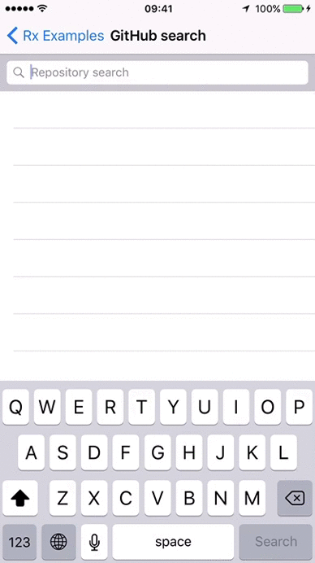

 RxSwift: ReactiveX for Swift
======================================

[](https://travis-ci.org/ReactiveX/RxSwift)   [](https://github.com/Carthage/Carthage) [](https://github.com/apple/swift-package-manager)  [](https://github.com/beeth0ven/RxSwift-Chinese-Documentation/releases/download/1.0.0/RxSwiftChineseDocumentation.epub)

[ReactiveX](http://reactivex.io/)（简写: Rx） 是一个可以帮助我们简化异步编程的框架。

它拓展了[观察者模式](https://zh.wikipedia.org/wiki/观察者模式)。使你能够自由组合多个异步事件，而不需要去关心线程，同步，线程安全，并发数据以及I/O阻塞。

[RxSwift](https://github.com/ReactiveX/RxSwift) 是 [Rx](https://github.com/Reactive-Extensions/Rx.NET) 的 **Swift** 版本。

它尝试将原有的一些概念移植到 iOS/macOS 平台。

你可以在这里找到跨平台文档 [ReactiveX.io](http://reactivex.io/)。

------

[RxSwift](https://github.com/ReactiveX/RxSwift) **QQ** 交流群: **424180219**

------
## 文档更新日志

#### 17年10月18日（RxSwift 4）

* 加入[文档电子书下载地址](https://github.com/beeth0ven/RxSwift-Chinese-Documentation/releases/download/1.0.0/RxSwiftChineseDocumentation.epub)
* 去掉学习资源[《如何将代理转换为序列》](https://medium.com/@maxofeden/rxswift-migrate-delegates-to-beautiful-observables-3e606a863048)，因为 RxSwift 4 重构了 **DelegateProxy**  [#1379](https://github.com/ReactiveX/RxSwift/pull/1379)
* 使用 `share(replay: 1)` 替换 `shareReplay(1)`
* 给 [RxJava 演示代码](/content/rxswift_ecosystem.md) 中的变量加上 `final` 关键字，声明为常量
* 示例[多层级的列表页](/content/more_demo/tableView_sectioned_viewController.md)更新到 RxSwift 4，使用新的 RxDataSources 构建方法
* 文档首页更新到 RxSwift 4

  **[... 点击查看更多](CHANGELOG.md)**

---

## 示例

Github 搜索...



定义搜索结果 ...
```swift
let searchResults = searchBar.rx.text.orEmpty
    .throttle(0.3, scheduler: MainScheduler.instance)
    .distinctUntilChanged()
    .flatMapLatest { query -> Observable<[Repository]> in
        if query.isEmpty {
            return .just([])
        }
        return searchGitHub(query)
            .catchErrorJustReturn([])
    }
    .observeOn(MainScheduler.instance)
```

... 然后将结果绑定到 tableview 上

```swift
searchResults
    .bind(to: tableView.rx.items(cellIdentifier: "Cell")) {
        (index, repository: Repository, cell) in
        cell.textLabel?.text = repository.name
        cell.detailTextLabel?.text = repository.url
    }
    .disposed(by: disposeBag)
```

------

## 必备条件

* Xcode 9.0
* Swift 4.0
* Swift 3.x ([使用 `rxswift-3.0` 分支](https://github.com/ReactiveX/RxSwift/tree/rxswift-3.0))
* Swift 2.3 ([使用 `rxswift-2.0` 分支](https://github.com/ReactiveX/RxSwift/tree/rxswift-2.0))

## 安装

安装 **RxSwift** 不需要任何第三方依赖。

以下是当前支持的安装方法：

### 手动

打开 Rx.xcworkspace, 选中 `RxExample` 并且点击运行。 此方法将构建所有内容并运行示例应用程序。

### [CocoaPods](https://guides.cocoapods.org/using/using-cocoapods.html)

** **`pod --version`**: **`1.3.1` 已通过测试

```ruby
# Podfile
use_frameworks!

target 'YOUR_TARGET_NAME' do
    pod 'RxSwift',    '~> 4.0'
    pod 'RxCocoa',    '~> 4.0'
end

# RxTests 和 RxBlocking 将在单元/集成测试中起到重要作用
target 'YOUR_TESTING_TARGET' do
    pod 'RxBlocking', '~> 4.0'
    pod 'RxTest',     '~> 4.0'
end
```

替换 `YOUR_TARGET_NAME` 然后在 `Podfile` 目录下, 终端输入：

```bash
$ pod install
```

### [Carthage](https://github.com/Carthage/Carthage)

** **`carthage version`**: **`0.26.2` 已通过测试

添加到 `Cartfile`

```
github "ReactiveX/RxSwift" ~> 4.0
```

```bash
$ carthage update
```

### [Swift Package Manager](https://github.com/apple/swift-package-manager)

**  **`swift build --version`**: **`Swift 4.0.0-dev (swiftpm-13126)` 已通过测试

创建`Package.swift` 文件。

```swift
// swift-tools-version:4.0

import PackageDescription

let package = Package(
  name: "RxTestProject",
  dependencies: [
    .package(url: "https://github.com/ReactiveX/RxSwift.git", "4.0.0" ..< "5.0.0")
  ],
  targets: [
    .target(name: "RxTestProject", dependencies: ["RxSwift", "RxCocoa"])
  ]
)
```

```bash
$ swift build
```

如果构建或测试一个模块对 RxTest 存在依赖， 设置 `TEST=1`. ([RxSwift >= 3.4.2](https://github.com/ReactiveX/RxSwift/releases/tag/3.4.2))

```bash
$ TEST=1 swift test
```

### 使用 submodules 手动集成

* 添加 RxSwift 作为子模块

```bash
$ git submodule add git@github.com:ReactiveX/RxSwift.git
```

* 拖拽 `Rx.xcodeproj` 到项目中
* 前往 `Project > Targets > Build Phases > Link Binary With Libraries`, 点击 `+` 并且选中 `RxSwift-[Platform]` 和 `RxCocoa-[Platform]`
